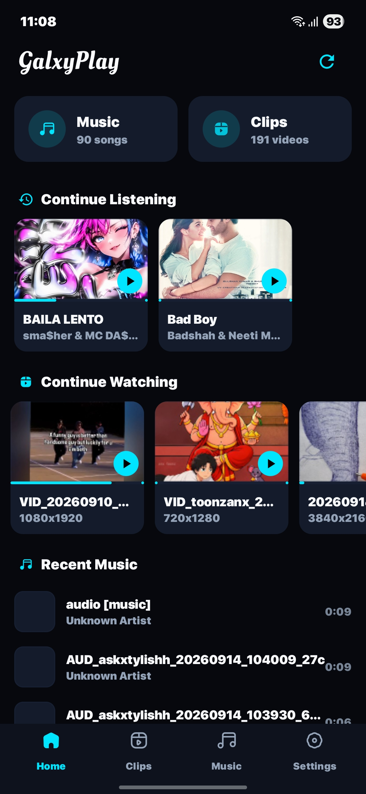
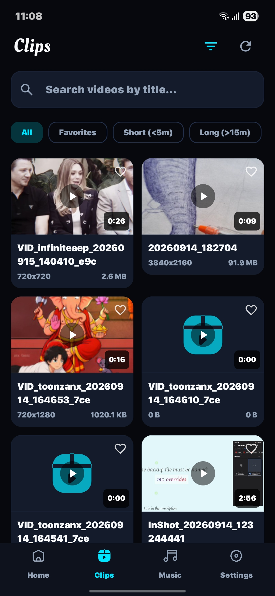
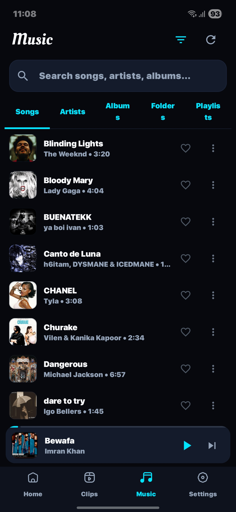
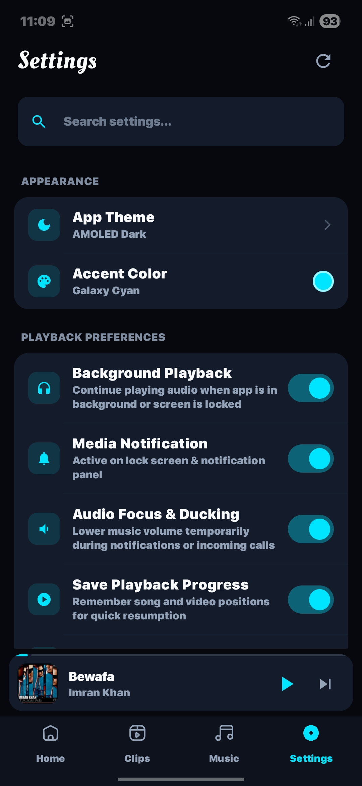

# Galaxy Play

> Pure Offline Media Player for Android

Galaxy Play is a clean, modern and privacy-focused Android media player built for your local music and video collection. No streaming catalog, account or cloud library is required.

## What's New

### Media Tools

- Create GIFs from any part of a video.
- Take screenshots from videos while playing.
- Share music and videos directly.
- Pin your favorite songs for quick access.
- Mark newly added songs with a customizable **New** label.
- Enable or disable the New label anytime.
- Choose how long the New label stays visible, such as 1 hour, 7 hours, or other custom durations.

### Music & Playback

- Local music library
- Artists and albums
- Artist images
- Folders and playlists
- Background playback
- Media notifications
- Audio focus and ducking
- Save playback progress
- Video playback speed
- Sleep timer
- Favorites
- Local media search

### Video

- Offline video and Clips library
- Video search
- Screenshot capture
- GIF creation
- Video sharing
- Playback speed control
- Local video playback

## Interface

Galaxy Play uses a minimal AMOLED-focused interface with a clean navigation system, dark surfaces, rounded components and a simple media-first layout.

## Offline First

Galaxy Play is designed around your local media.

Scan your device, organize your music and videos, and play them directly without requiring a streaming service or cloud library.

Your media stays on your device.

## Screenshots

<div align="center">

<table>
  <tr>
    <td></td>
    <td></td>
  </tr>
  <tr>
    <td></td>
    <td></td>
  </tr>
</table>

</div>

## Installation

1. Download the latest APK from the Releases section.
2. Install Galaxy Play.
3. Grant the required media permissions.
4. Scan your device storage.
5. Start playing your local media.

## Development

Clone the repository:

```bash
git clone https://github.com/skykoderhere/GalaxyPlay.git
